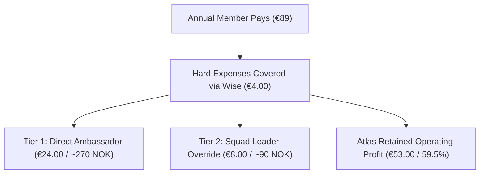

# ATLAS TRAVEL CLUB — MASTER PRODUCT & FINANCIAL SPECIFICATION
**Operating Entity:** Hard Rock Capital Ltd (UK Company No. 16833237)  
**Platform Domain:** `atlastravelclub.com`  
**Fintech Partner:** Wise Platform (Wise Multi-Currency Treasury, Card Issuing & Payouts API)  
**Wholesale Bedbanks:** WebBeds, Hotelbeds, RateHawk  
**Version:** 3.1 (Optional Card & Frictionless Checkout Update)  
**Updated:** October 2026  

---

## 1. Core Operating Architecture & Dual Revenue Streams

Atlas Travel Club operates on a transparent, digital-Costco model for travel: **0% Retail Markup on Hotel Inventory + 2 Distinct Revenue Streams**.

```
                           ATLAS TRAVEL CLUB REVENUE STREAMS
                                          │
                  ┌───────────────────────┴───────────────────────┐
                  ▼                                               ▼
         [ STREAM 1: MEMBERSHIP ]                      [ STREAM 2: BOOKINGS ]
            €89 / 990 NOK / yr                            3.5% Transaction Fee
      Predictable Subscription ARR                 At-Cost Merchant & Clearing Buffer
      Powers "Recruit 3 & Free" Viral Loop         Covers Wise & Bedbank Settlement
```

### Stream 1: Annual Membership Subscription (€89 / 990 NOK / £79 / ~$89)
* **Single Tier:** One clean annual membership granting 100% full access to all wholesale hotel & resort feeds.
* **Frictionless Checkout (NO Mandatory Card Issuance):**
  * Members sign up using **ANY existing credit/debit card, Apple Pay, or Google Pay**.
  * **Zero forced KYC friction** at signup. Users do NOT have to take a Wise card to become members or book hotels.
* **Per-Member Expense Breakdown:**
  * Gateway & processing fee: **~€1.90**
  * Wise Platform digital card budget (Apple/Google Wallet pass): **~€1.10** *(retained by Atlas as extra profit if member never activates the card)*
  * Cloud infrastructure & API query buffer: **~€1.00**
  * *Total hard unit costs covered:* **€4.00** per member.
* **Remaining Net Distributable Pool:** **€85.00** (95.5%).

### Stream 2: Booking Transaction & Merchant Clearing Fee (3.5%)
* **Mechanism:** Calculated dynamically at hotel checkout:
  $$\text{Transaction Fee} = \text{Raw Wholesale Total} \times 0.035$$
* **Legal & Marketing Positioning:** 
  > *"ATLAS passes 100% net wholesale rates with 0% hotel room markup. A nominal 3.5% transaction fee is charged at cost to cover merchant credit card interchange and B2B settlement."*
* **Commercial Purpose:**
  * Ensures Atlas **never loses money** on credit card processing or B2B VCC supplier settlement fees.
  * Preserves massive savings for the member (who still saves 18% to 35% compared to public OTAs charging 20%–40% markups).
  * Creates continuous transactional revenue as members book multiple trips each year.

---

## 2. The Card Policy: "Included Free as an Optional Perk"

> [!IMPORTANT]
> **NO FORCED CARDS & ZERO SIGN-UP FRICTION**
> Forcing a payment card at checkout destroys conversion rates due to KYC/ID verification and existing card loyalty (airline points/miles).

* **How It Works in the Member Journey:**
  1. **Signup & Booking:** User pays the €89 fee with their everyday card and can book hotels immediately.
  2. **In-Dashboard Opt-In:** Inside the portal, an optional banner offers:  
     > *"Claim Your Atlas Travel Card powered by Wise (Included Free) — Save 3% on foreign currency abroad with real mid-market exchange rates."*
  3. **Activation:** If the member chooses to activate it, they complete 1-click KYC when convenient and add the card to Apple Pay / Google Pay. The cost was already covered by their initial €89 payment.
  4. **Non-Activation:** If they never claim the card, Atlas keeps the budgeted **€1.10** as additional profit.

---

## 3. The Viral Growth Engine: "Recruit 3 & Stay Free"

The primary organic customer acquisition mechanism is:

> **"Recruit 3 Paying Friends — Stay 100% Free as Long as They Remain Active."**

### How "3 & Free" Operates:
1. **The Automatic Unlock:** When a member’s referral link attributes 3 active, paying annual members, their own annual subscription charge is automatically discounted to **€0.00 / year**.
2. **The Retention Lock:** If one of their 3 recruits churns, the member enters a 30-day grace period to recruit a replacement before annual billing resumes. Members proactively keep their friends active to maintain their free status.
3. **Cluster Unit Economics (4 Users: 3 Paying + 1 Free):**
   * Total Gross Revenue Collected: $3 \times €89 = \mathbf{€267.00}$
   * Hard Costs Across all 4 Accounts: $4 \times €4.00 = \mathbf{-€16.00}$
   * **Net Profit to Atlas: €251.00 (€62.75 per user) at €0 Customer Acquisition Cost.**

---

## 4. The 2-Tier Team & Affiliate Compensation Model (Recruits 4+ and Beyond)

For content creators, travel advisors, digital nomads, and network leaders who build distribution squads, Atlas provides a clean, legitimate **2-tier affiliate structure** (avoiding MLM compliance traps):



| Role / Level | Payout Amount | Description |
| :--- | :--- | :--- |
| **Recruits 1 – 3** | **€0.00 cash** | Waives the member's own annual fee (**"3 & Free"**). |
| **Tier 1: Direct Ambassador (Recruit #4+)** | **€24.00 / yr** *(recurring)* | Earned directly on personal referrals upon annual renewal. |
| **Tier 2: Squad Leader Override** | **€8.00 / yr** *(recurring)* | Earned by a Team Leader on every member recruited by their direct ambassadors. |
| **Atlas Net Retained Margin** | **€53.00 / yr** *(59.5%)* | Safe, predictable subscription margin retained by Atlas. |
| **Payout Rail** | **Wise Payouts API** | Direct bank transfers in 70+ local currencies at real mid-market exchange rates. |

### Squad Leader Leverage (The "Team" Pitch):
* A Team Leader recruits **10 Ambassadors**.
* Each Ambassador onboards **30 paying members** (300 members in the squad).
* Each Ambassador earns: $30 \times €24 = \mathbf{€720/\text{year}}$.
* The Team Leader passively earns: $300 \times €8 = \mathbf{€2,400 / \sim 27,000\text{ NOK/year}}$ in passive team overrides.

---

## 5. Technical Database & Webhook Directives for Codebase

* **`users` Table:**
  * `referral_code`: Unique slug (`atlastravelclub.com/join?ref=paul`).
  * `referred_by`: Sponsor user ID (Tier 1).
  * `parent_leader_id`: Squad leader user ID (Tier 2).
  * `membership_status`: `'active'`, `'free_by_3'`, `'past_due'`, `'cancelled'`.
  * `active_referrals_count`: Integer counter of active paying recruits.
  * `wise_card_status`: `'not_requested'`, `'pending_kyc'`, `'active'`, `'physical_ordered'`.
  * `wise_recipient_id`: Target bank details for Wise Payouts.
* **`commissions_ledger` Table:**
  * `id`, `payer_user_id`, `recipient_user_id`, `tier` (`1` or `2`), `amount_eur`, `status` (`pending`, `paid_via_wise`, `void_refund`), `created_at`.
* **Checkout & Webhook Actions:**
  * Dynamic calculation of 3.5% transaction fee on all hotel booking checkout routes (`rawWholesaleTotal * 0.035`).
  * On annual membership payment: increment referrer's count. If count == 3, set referrer status to `free_by_3` and apply zero-cost billing pass.
  * For referrals $\ge 4$: append row to `commissions_ledger` (€24 for Tier 1, €8 for Tier 2).
