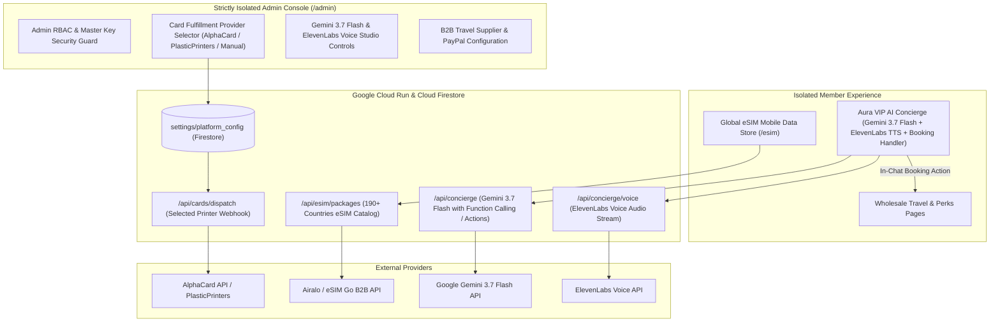

# Implementation Plan: Card Fulfillment Switcher, Global eSIM Data, Gemini 3.7 + ElevenLabs Autonomous AI Concierge & Strict Admin Isolation

Integrate an Admin fulfillment provider selector, seamless global eSIM travel data, an autonomous AI Travel Concierge (powered by Google Gemini 3.7 Flash and ElevenLabs Voice AI with in-chat booking capability), and strict architectural isolation for the Admin console.

---

## 1. System Architecture

---

## 2. Proposed Modules & Technical Enhancements

### A. Physical Card Fulfillment Provider Selector (Admin)
- Dedicated settings panel in `/admin` allowing the operator to select the active fulfillment agent:
  1. **AlphaCard Cloud API** (Automated single-card on-demand direct mail)
  2. **PlasticPrinters.com API** (Batch & direct dropshipping)
  3. **Plastic Resource API** (Bulk CR80 PVC production)
  4. **Manual / In-House Fulfillment** (Exports batch CSV for local thermal card printers)
- Fields for **API Key**, **Webhook URL**, **Postage Class** (USPS First Class / FedEx Priority), and **Auto-Dispatch on Member Order** toggle.

### B. Global SIM-less Travel eSIM Data (`/esim`)
- **Coverage**: 190+ countries across North America, Europe, Asia, Latin America, Middle East.
- **Packages**: 1GB, 3GB, 5GB, 10GB, and Unlimited 5G/4G High-Speed Data.
- **Pricing**: Wholesale member rates starting at **$4.50** (vs. $10–$15 retail eSIMs and $10/day carrier roaming).
- **Instant Activation**: Digital QR code scan delivered directly to the member's phone.
- **AI Integration**: AI Concierge has full knowledge of country data packages and setup instructions.

### C. Autonomous VIP AI Travel Concierge (Gemini 3.7 Flash + ElevenLabs Voice)
- **Engine**: Configurable **Gemini 3.7 Flash** system prompt with deep travel knowledge, wholesale pricing secrets, and destination guides.
- **Autonomous In-Chat Booking Execution**: When a member says *"Book the Bellagio for Sep 15-18 with my Gold membership"*, the AI parses dates, verifies wholesale availability, and generates an interactive **"Confirm & Lock Wholesale Reservation"** checkout card directly inside the chat window.
- **ElevenLabs Voice AI Integration**:
  - Realistic human concierge voice synthesis (e.g. Rachel / Adam / Custom VIP Concierge Voice).
  - Admin controls for **ElevenLabs API Key**, **Voice ID**, **Stability**, and **Clarity / Similarity Boost**.
  - Audio player in the concierge widget with real-time speech toggle.
- **Inquiry Scanner**: Upload or paste flight confirmations, hotel URLs, or itinerary text for instant savings analysis.

### D. Strict Admin Console Isolation (`/admin`)
- Complete separation from consumer member routes.
- Dedicated Admin Layout with independent authentication guard, master access key check, and separate sidebar navigation.

---

## 3. Proposed File Changes

### [NEW] eSIM & Voice Services
- [NEW] `hotel-club-platform/src/app/esim/page.tsx` (Global eSIM Data plans & instant QR activation)
- [NEW] `hotel-club-platform/src/app/api/esim/packages/route.ts` (eSIM packages catalog API)
- [NEW] `hotel-club-platform/src/app/api/concierge/voice/route.ts` (ElevenLabs Text-to-Speech audio generator)

### [MODIFY] AI Concierge & Studio Components
- [MODIFY] `hotel-club-platform/src/app/api/concierge/route.ts` (Integrate Gemini 3.7 Flash reasoning, eSIM knowledge, and autonomous booking actions)
- [MODIFY] `hotel-club-platform/src/components/AITravelConcierge.tsx` (Add ElevenLabs voice playback, inquiry parser, and in-chat booking card)

### [MODIFY] Admin Isolation & Settings
- [MODIFY] `hotel-club-platform/src/app/admin/page.tsx` (Add **Card Fulfillment Provider Selector**, **Gemini 3.7 / ElevenLabs AI Studio Controls**, and **eSIM Margin Settings**)
- [NEW] `hotel-club-platform/src/app/admin/layout.tsx` (Strict isolated layout with security guard)
- [MODIFY] `hotel-club-platform/src/components/Navbar.tsx` (Add eSIM navigation link)

---

## 4. Verification Plan

1. **Build & Type Check**: Run `npm run build` to verify clean compilation of all new routes, ElevenLabs voice streaming, and Gemini 3.7 Flash schemas.
2. **Card Provider Switcher Test**: Switch between AlphaCard, PlasticPrinters, and In-House in the Admin console and verify configuration persistence.
3. **eSIM Storefront Test**: Browse country eSIM packages, test QR activation modal, and verify wholesale pricing.
4. **Autonomous AI Concierge Test**: Ask the concierge to book a stay, verify in-chat reservation card rendering, and test ElevenLabs voice audio playback.
5. **Admin Isolation Test**: Verify that the Admin portal runs with its own security shell and does not leak into consumer views.
